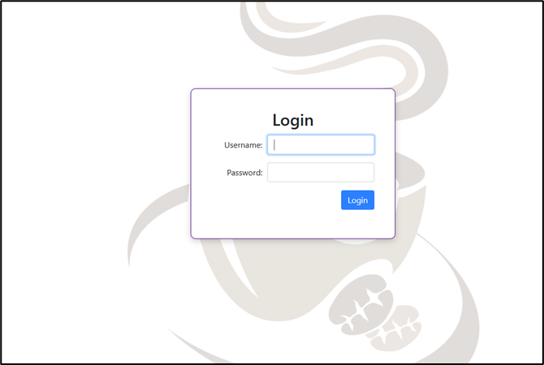

Разработка приложения для работы заведения общественного питания (кафетерия) на базе монолитной архитектуры

**Оглавление**

[1. Введение](#1)

[1.1. Описание предметной области проекта](#1.1)

[1.2. Цели и задачи проекта](#1.2)

[1.3. Обзор используемых технологий и инструментов](#1.3)

[2. Анализ требований](#2)

[2.1. Функциональные требования](#2.1)

[2.2. Нефункциональные требования](#2.2)

[2.3. Архитектурные документы](#2.3)

[3\. Архитектура проекта](#3)

[3.1. Обзор архитектуры приложения](#3.1)

[3.2. Описание слоев приложения](#3.2)

[4. Проектирование базы данных](#4)

[4.1. Модель данных приложения](#4.1)

[4.2. Классы-сущности приложения](#4.2)

[4.3. Использование JPA/Hibernate для доступа к данным](#4.3)

[5. IML диаграмма классов](#5)

[6. Use-Case диаграмма](#6)

[7. Реализация](#7)

[7.1. Нефункциональный блок](#7.1)

[7.1.1. Конфигурация приложения](#7.1.1)

[7.1.2. Конфигурация безопасности Spring Security](#7.1.2)

[7.1.3. Аспекты (AOP)](#7.1.3)

[7.2. Интерфейс](#7.2)

[7.2.1. Кассир](#7.2.1)

[7.2.1.1. Формирование заказа](#7.2.1.1)

[7.2.1.2. Оформление чека](#7.2.1.2)

[7.2.2. Повар](#7.2.2)

[7.2.3. Клиент](#7.2.3)

[7.2.4. Менеджер](#7.2.4)

[7.2.4.1. Редактирование меню](#7.2.4.1)

[7.2.4.2. Управление финансами](#7.2.4.2)

[7.2.4.3. Управление персоналом](#7.2.4.3)

[7.2.4.4. Система лояльности](#7.2.4.4)

[7.3. Реализация функционала интерфейса (backend)](#7.3)

[7.3.1. Блок кассира](#7.3.1)

[7.3.2. Блок повара](#7.3.2)

[7.3.3. Блок менеджера](#7.3.3)

[8. Заключение](#8)

[8.1. Общий обзор выполненной работы](#8.1)

[8.2. Полученные результаты и достижения](#8.2)

[8.3. Выводы и дальнейшие перспективы развития проекта](#8.3)

[9. Список использованной литературы](#9)

[Приложения. Диаграмма компонентов](#10)


# 1. Введение <a id='1'></a>

## 1.1. Описание предметной области проекта <a id='1.1'></a>

В настоящее время любое, даже самое маленькое частное предприятие, стремится максимально автоматизировать свою работу при помощи средств сферы IT. Электронные кассы, мгновенно отправляющие информацию во все необходимые базы данных для формирования отчётности и статистики по организации, автоматизированные рабочие места, требующие минимального вмешательства работников и, наконец, системы «искусственного интеллекта» – нейросети, быстро и широко захватившие все сферы от дизайна до медицины – стали неотъемлемой и максимально востребованной частью предприятий любого масштаба и любого вида собственности.

Крупные корпорации и большие организации могут себе позволить разрабатывать свой собственный программный продукт, всесторонне удовлетворяющий любые потребности как сотрудников, так и клиентов. Предприятия поменьше часто лишены такой возможности и всё, что им остаётся – это закупать уже готовое программное обеспечение, которое не всегда может удовлетворить все нужды малого бизнеса.

## 1.2. Цели и задачи проекта <a id='1.2'></a>

В настоящей работе была предпринята попытка создания программного продукта для функционирования малого предприятия сферы общественного питания (кафе, кофейни, кондитерской).

Целью настоящего проекта является созданием удобного в использовании, интуитивно понятного и быстрого приложения, способного облегчить работу сотрудников кафетерия. Для выполнения этой задачи были предприняты следующие шаги:

- построение базы данных, описывающей все сущности для работы кафетерия;
- разработка удобного интерфейса для каждой из ролей, присутствующей в работе предприятия: менеджер, кассир, повар и клиент – для покрытия всего цикла работы предприятия;
- реализация всех функций интерфейса: работа меню, корзины, формирование чеков и заказов, отправляемых на кухню, программа лояльности для клиентов, система выдачи заказов;
- обеспечение слаженности и бесперебойности работы программного продукта для всех участников рабочего процесса: лёгкость и многогранность настройки, продуманность деталей, простота использования;
- обеспечение безопасности данных пользователей и администраторов приложения.

## 1.3. Обзор используемых технологий и инструментов <a id='1.3'></a>

Для реализации обозначенного круга задач было принято решение использовать фреймворк Spring – популярный, современный и мощный инструмент для разработки web-приложений на Java, так как он предоставляет широкий набор инструментов и функциональности для создания высокопроизводительных и масштабируемых приложений. В совокупности со Spring в проекте были использованы следующие технологии и компоненты:

- **Spring Boot** – это проект, который упрощает создание автономных, готовых к эксплуатации приложений на базе Spring. Основные преимущества включают автоматическую настройку, предустановленные шаблоны и возможность быстрого запуска приложения без необходимости в сложной конфигурации.
- **Spring Web** предоставляет функциональность для создания веб-приложений. Он включает поддержку для разработки RESTful сервисов, обработки HTTP-запросов и ответов, а также интеграцию с различными веб-технологиями и фреймворками.
- **Spring Security** – это мощный и настраиваемый фреймворк для аутентификации и авторизации в приложениях на базе Spring. Он поддерживает множество механизмов безопасности, таких как базовая аутентификация, OAuth2, LDAP, и обеспечивает защиту от таких атак, как CSRF, XSS.
- **Spring MVC (Model-View-Controller)** используется для построения веб-приложений на основе шаблона проектирования MVC. Он обеспечивает разделение бизнес-логики, отображения данных и управления запросами, что делает приложение более гибким и легко поддерживаемым.
- **Spring Boot Starter Validation: э**тот стартер включает поддержку валидации данных на основе Java Bean Validation API. Он позволяет легко аннотировать модели данных для проверки их корректности перед сохранением или обработкой, что помогает гарантировать целостность данных в приложении.
- **Thymeleaf** – это серверный шаблонизатор, предназначенный для генерирования HTML, XML, JavaScript и других типов файлов. Он интегрируется с Spring и позволяет создавать динамические веб-страницы с использованием современных шаблонов и синтаксиса.
- **Spring Data** – это проект, созданный для упрощения работы с различными типами баз данных, включая реляционные, документные, графовые и другие. Он предоставляет единый, унифицированный подход к доступу к данным, абстрагируя сложности низкоуровневого взаимодействия с базой данных. С помощью Spring Data разработчики могут легко выполнять CRUD-операции, создавать сложные запросы, а также использовать множество встроенных функциональностей для работы с данными, таких как пагинация, сортировка и кэширование.

В качестве основной рабочей базы данных для проекта был выбран движок **MySQL**. MySQL – это одна из самых популярных реляционных баз данных, используемая для хранения и управления данными в приложениях. В сочетании с Spring Data JPA, она обеспечивает удобный и производительный доступ к данным с использованием объектов и репозиториев.

Также в проект включена база данных H2. **H2** – это встраиваемая база данных, которая часто используется для тестирования и разработки. В комбинации с Spring Boot Starter Data JPA, H2 позволяет быстро развернуть базу данных для разработки, тестирования и демонстрации функционала без необходимости в настройке полноценной СУБД.

- **Project Lombok** – библиотека, которая помогает уменьшить количество шаблонного кода в Java. С помощью аннотаций Lombok, таких как @Getter, @Setter, @Data и других можно автоматически генерировать методы доступа, конструкторы и другие элементы кода, что упрощает разработку и поддержку проекта.
- **Spring Boot Starter Test** включает в себя все необходимые зависимости для тестирования приложений на базе Spring Boot, такие как JUnit, Mockito и Spring Test. Spring Security Test предоставляет дополнительные утилиты и аннотации для тестирования безопасности приложений, обеспечивая возможность проверки различных сценариев аутентификации и авторизации.
- **Spring Boot DevTools** – это набор инструментов для разработчиков, включающий функции автоматической перезагрузки, улучшенной настройки и упрощенной отладки. DevTools ускоряет процесс разработки, позволяя мгновенно видеть изменения в коде без необходимости вручную перезапускать сервер.

Выбранные инструменты имеют подробную документацию, широко поддерживаются в профессиональном сообществе, поэтому всегда актуальны и востребованы. Эти факторы в совокупности с эффективностью и удобством использования обеспечат создание современного и мощного приложения, отвечающего самым высоким стандартам качества и безопасности, а также позволят в дальнейшем осуществить лёгкую интеграцию с другими сервисами (например, банкинг) и расширение функциональности приложения, реализуя растущие потребности предприятия.

# 2. Анализ требований <a id='2'></a>
 
## 2.1. Функциональные требования <a id='2.1'></a>

Модель приложения основана на одном из сценариев работы заведений общепита. Программное обеспечение рассчитано только на внутреннее использование, например, в кафе. Кассир формирует корзину из опроса клиента. На основании корзины формируется чек, к которому прикрепляется система лояльности (при наличии). Заказы на блюда из корзины поступают на кухню. Повара отмечают готовые блюда и передают их на выдачу. Клиент в это время наблюдает на специальном экране за ходом выполнения и заказа и оповещается о его готовности.

**Персонал:**

Персонал является отправной точкой работы любого предприятия. В настоящем веб-приложении реализовано распределение функционала в зависимости от роли пользователя, вошедшего в систему. Данные о пользователях связаны с аккаунтами для входа в систему. Реализована зависимость доступа пользователя в систему от диапазона дат между приёмом на работу и увольнением.

**Меню:**

Меню – основная сущность, вокруг которой строится работа всего приложения. Блюда в меню группируются по разделам. На основании активных блюд кассиром формируется корзина – заказ клиента. Меню может быть довольно тонко организовано: можно менять порядок разделов, добавлять новые блюда, активировать или деактивировать блюда в зависимости от ситуации на кухне, отправлять блюда в архив и восстанавливать из него, устанавливать блюдам специальную (акционную) цену.

**Корзина, заказы и чеки:**

Корзина формируется кассиром из опроса клиента. Корзина имеет возможность редактирования как на этапе формирования, так и на этапе подготовки к оплате, на случай, если клиент передумал. На основании корзины формируются финансовый чек (с учётом системы скидок) и список заказов для кухни.

**Система лояльности:**

Система лояльности подразумевает создание линейки скидок, основанной на общей сумме покупок клиента в заведении. Для этого на клиента, желающего пользоваться скидками, кассиром во время заказа оформляется бонусная карта, прикрепляющаяся к номеру телефона клиента. Карта накапливает сумму покупок после каждого оплаченного чека и автоматически меняет свой номинал (повышает процент скидки) в зависимости от настроек бонусной системы.

**Управление работой приложения:**

Главное лицо, управляющее всеми аспектами работы заведения – его менеджер. Его функциональные возможности в приложении максимально широки. Менеджер полностью настраивает меню. Может просматривать и в определенной степени редактировать финансовые данные, получать аналитику. Также в его возможности входят управление данными о персонале (в том числе аккаунты) и формирование бонусной системы лояльности для привлечения клиентов (дисконтные карты).

**Клиентский интерфейс:**

Клиент, оплативший заказ, получает чек с кодом заказа на руки. За процессом приготовления он может наблюдать на отдельном экране, где отображаются списки заказов, которые находятся в процессе приготовления, и тех, которые уже готовы. Получение заказа происходит по коду на чеке клиента.

## 2.2. Нефункциональные требования <a id='2.2'></a>

**Безопасность:**

Безопасность данных пользователей является одним из приоритетов в разработке веб-приложения, обеспечивающих защиту пользовательских данных от несанкционированного доступа и изменения. Это достигается путем использования современных методов шифрования данных и особых механизмов хранения паролей.

Важным элементом безопасности является использование механизмов аутентификации и авторизации для контроля доступа к функциональности приложения. В проекте используется шифрование Bcrypt. Bcrypt — это популярный алгоритм хэширования паролей, предназначенный для защиты паролей пользователей в системах. Он основан на алгоритме Blowfish и предназначен для медленного выполнения, что делает его устойчивым к атакам методом перебора (brute force). При использовании bcrypt для хэширования паролей в приложении, каждый пароль обрабатывается с добавлением уникальной соли и множества итераций хэширования, что значительно усложняет его взлом.

Для простоты и скорости разработки в приложении была отключена защита CSRF. CSRF (Cross-Site Request Forgery) — это тип атаки, при котором злоумышленник заставляет пользователя выполнить нежелательные действия на доверенном веб-сайте, где он аутентифицирован. При дальнейшей разработке проекта защита CSRF будет включена в модель безопасности, для чего будут доработаны методы, использующие все POST, PUT, DELETE и PATCH запросы, требующие наличия CSRF токена, а также обновлён код FrontEnd-части приложения, чтобы все формы (forms) и AJAX запросы содержали CSRF токен.

**Надежность:**

Надежность работы web-приложения играет важную роль в обеспечении бесперебойной работы бизнеса. Она выражается в стабильной работе, для чего необходимы регулярный мониторинг системы и быстрое реагирования на возможные сбои. В проектируемом веб-приложении предусмотрена система обработки ошибок (ошибки запросов и исключения). Наряду с перечисленным неотъемлемой частью надежности системы является резервное копирование, позволяющее восстановить данные в экстренных ситуациях.

**Производительность:**

Производительность приложения имеет важнейшее значение для позитивного пользовательского опыта и удовлетворенности клиентов. Для ускорения производительности необходимы:

- оптимизация кода,
- использование кэширования данных,
- масштабируемость системы для обработки большого количества запросов при увеличении нагрузки и обеспечение стабильной производительности в любых условиях.

В дальнейшем планируется доработка приложения для использования его одновременно в нескольких точках сети заведений общественного питания. Поэтому система должна эффективно масштабироваться и обеспечивать стабильную производительность в любых условиях.

**Удобство использования:**

UX (User Experience) и UI (User Interface) — это ключевые аспекты разработки приложений, которые непосредственно влияют на удовлетворенность и удобство пользователей. UX фокусируется на общем опыте взаимодействия пользователя с приложением, включая навигацию, логичность структуры и эффективность выполнения задач. UI занимается визуальным оформлением и взаимодействием, обеспечивая привлекательность и интуитивно понятный интерфейс. Хорошо проработанные UX и UI улучшают пользовательский опыт, увеличивают вовлеченность и удовлетворенность, что в конечном итоге способствует успеху приложения на рынке.

## 2.3. Архитектурные документы <a id='2.3'></a>

**Диаграмма компонентов:**

Диаграмма компонентов – это тип диаграммы UML (Unified Modeling Language), который используется для визуализации и документирования структуры программных систем на уровне компонентов. На диаграмме разрабатываемого веб-приложения представлены основные компоненты, составляющие монолитную структуру и связи между сервисами фреймворка Spring: веб-приложение (компоненты системы для работы каждой из ролей), модуль безопасности, обеспечиваемый Spring Security, база данных и другие сервисы. Взаимосвязи между компонентами позволяют понять структуру приложения и потоки данных между ними. (см. Приложение).

**Диаграмма развертывания:**

Диаграмма развертывания является частью UML (Unified Modeling Language) и используется для визуализации архитектурных аспектов системы, связанных с её физическим размещением и взаимодействием между аппаратными и программными компонентами. В контексте текущего приложения на диаграмме представлены серверы базы данных, серверы приложений, серверы для микросервисов, а также шлюз API. Диаграмма развертывания позволяет инженерам по системному администрированию и разработчикам видеть, как компоненты системы физически размещаются и как они взаимодействуют между собой и с окружающей средой.

**Диаграмма классов:**

Диаграмма классов (Class Diagram) представляет статическую структуру системы, показывая классы, их атрибуты, методы и взаимосвязи между ними. Используется для моделирования структуры системы, документирования проектных решений и для облегчения понимания и разработки программного обеспечения. Для разрабатываемого приложения диаграмма классов показывает классы, такие как User, Staff, BonusCard, Receipt, MenuItem и другие, их атрибуты и методы, а также взаимосвязи между этими классами, например, ассоциации между пользователем и ролью, или между чеком и статусом чека. (см. Приложение).

**Диаграмма последовательности:**

Диаграмма последовательности (Sequence Diagram) моделирует взаимодействие объектов в системе с течением времени, показывая порядок обмена сообщениями между объектами для выполнения определенного сценария. Используется для детализации поведения системы, проектирования алгоритмов и документирования взаимодействий между объектами. Применимо к разрабатываемому приложению на диаграмме будут показаны различные сценарии протекания процесса, такие как процесс создания нового чека или применения скидки. Например, последовательность взаимодействий между пользователем, кассиром, системой скидок и базой данных для выполнения определенной задачи. (см. Приложение).

**Диаграмма состояний:**

Диаграмма состояний (State Diagram) описывает различные состояния объекта и переходы между этими состояниями в зависимости от событий. Используется для моделирования поведения системы или объекта на протяжении его жизненного цикла, а также для анализа и проектирования сложных систем. Диаграмма состояний рассматриваемого приложения будет описывать, например, состояния чека (OPEN, READY TO PAY, PAID, CLOSED) и переходы между этими состояниями, что поможет лучше понять и спроектировать логику работы с чеками. (см. Приложение).

**Диаграмма данных:**

На диаграмме данных (Data Diagram) отображаются сущности базы данных, их атрибуты и связи между ними: пункты меню, чеки, заказы, сотрудники, данные об их аккаунтах и другое. Эта диаграмма помогает понять структуру данных приложения и их взаимосвязь для более эффективного проектирования и работы с данными. (см. Приложение).

# 3. Архитектура проекта <a id='3'></a>

## 3.1. Обзор архитектуры приложения <a id='3.1'></a>

Архитектура приложения — это структурное описание всех компонентов приложения и их взаимодействий, которое включает клиентскую часть (Frontend), серверную часть (Backend) и базу данных.

Клиентская часть (Frontend) – это интерфейс, с которым взаимодействует пользователь. Он включает в себя HTML, CSS и JavaScript для отображения и управления пользовательским интерфейсом.

Серверная часть (Backend) – это логика приложения, которая обрабатывает запросы от клиента, выполняет бизнес-логику и взаимодействует с базой данных.

База данных – это хранилище данных приложения. База данных управляет сохранением, обновлением и удалением данных, обеспечивая их целостность и доступность для серверной части приложения.

Для реализации проекта выбрана монолитная архитектура, которая представляет собой единую структуру приложения, где все компоненты объединены в один модуль. Вот основные преимущества монолитной архитектуры:

1. Простота разработки и тестирования:

- Единая кодовая база: Легче управлять и разрабатывать, так как все компоненты приложения находятся в одном месте.
- Целостное тестирование: Проще проводить интеграционное тестирование, так как все модули и компоненты уже интегрированы.

1. Производительность: Внутренние вызовы методов быстрее, чем сетевые запросы между микросервисами, что может улучшить производительность приложения.
2. Упрощенное развертывание:

- Целостное развертывание: Легче развернуть и управлять приложением, так как все компоненты развертываются одновременно.
- Меньше точек отказа: Меньше отдельных сервисов, которые могут выйти из строя, что упрощает управление отказоустойчивостью.

1. Упрощенное управление:

- Единая конфигурация: Упрощенная конфигурация и управление зависимостями, поскольку все компоненты находятся в одном проекте.
- Централизованное логирование и мониторинг: Проще настроить и управлять логированием и мониторингом, так как все происходит в рамках одного приложения.

1. Снижение затрат на разработку:

- Начальные затраты: Меньшие начальные затраты на разработку и внедрение, так как не требуется разбиение на микросервисы и управление их взаимодействием.
- Меньшие требования к инфраструктуре: Не требуется сложная инфраструктура для управления множеством сервисов и сетевых взаимодействий между ними.

## 3.2. Описание слоев приложения <a id='3.2'></a>

Архитектура приложения обычно разделяется на три основных слоя: представления, бизнес-логику и доступ к данным.

**Слой представления** отвечает за взаимодействие с пользователем. Он обеспечивает отображение данных и обработку пользовательского ввода, предоставляя интуитивно понятный и удобный интерфейс. При разработке представления использовался такой мощный инструмент Spring, как Thymeleaf. Это серверный шаблонизатор, который позволяет динамически генерировать HTML-страницы на основе данных из модели. Thymeleaf легко сочетается с Spring MVC, обеспечивая удобную и мощную генерацию контента.

Для добавления интерактивности на веб-страницы к шаблонам был подключен Java Script. Благодаря ему были созданы динамические элементы, такие как модальные окна, реализована валидация форм на клиентской стороне и асинхронное взаимодействие с сервером через AJAX. Сочетание Thymeleaf и JavaScript позволяет создавать богатые и динамичные пользовательские интерфейсы. Thymeleaf генерирует начальную HTML-страницу, а JavaScript добавляет интерактивные элементы и улучшает пользовательский опыт без необходимости перезагрузки страницы. Это обеспечивает быструю и отзывчивую работу веб-приложения.

Для придания интерфейсу приятного внешнего вида и удобства взаимодействия были использованы мощности BootStrap. Это CSS-фреймворк, который используется для создания адаптивных и стильных веб-интерфейсов. Он предоставляет набор готовых компонентов и утилит, которые позволяют быстро и легко создавать современные веб-страницы.

Красивая внешняя часть, контактирующая с пользователем, находится под управлением контролеров. В Spring MVC контроллеры обрабатывают HTTP-запросы и возвращают соответствующие представления. Разделение контроллеров по функциональным ролям (менеджер, кассир, повар, клиент) позволяет структурировать код и улучшить читаемость и поддержку.

**Слой базы данных** отвечает за хранение, управление и доступ к данным приложения. Он обеспечивает целостность данных и их долговременное хранение. Благодаря Spring Data – неотъемлемой части Spring Framework – доступ к базе данных кратно упрощается. Spring Data предоставляет репозитории, которые позволяют легко выполнять CRUD-операции и создавать пользовательские запросы с минимальными усилиями. База данных текущего проекта была разработана с использованием MySQL – это проверенная временем реляционная база данных, которая обеспечивает надежное хранение данных, поддержку транзакций и мощные механизмы для выполнения сложных запросов. Сочетание Spring Data и MySQL позволяет сосредоточиться на бизнес-логике, а не на низкоуровневых деталях работы с базой данных.

**Слой бизнес-логики** объединяет представление и базу данных, реализуя правила и процессы, специфичные для приложения. Он обрабатывает данные и управляет взаимодействием между пользовательским интерфейсом и базой данных.

Слой бизнес-логики представлен несколькими классами сервисов. Каждый сервис описывает логику обработки конкретных сущностей, представленных в базе данных. Сервисы обеспечивают выполнение бизнес-правил, обработку данных и взаимодействие с репозиториями базы данных.

Для передачи данных из слоя бизнес-логики в слой представления и обратно использовались **Data Transfer Objects (DTOs)**. DTOs обеспечивают четкое разделение данных и логики представления, уменьшая зависимость между слоями. Сервисы инкапсулируют бизнес-логику, делая код более модульным и легко тестируемым. Это позволяет поддерживать и расширять приложение с минимальными усилиями, улучшая его архитектуру и качество кода.

# 4. Проектирование базы данных <a id='4'></a>

## 4.1. Модель данных приложения <a id='4.1'></a>

Модель данных проектируемого приложения представлена совокупностью сущностей, описывающих объекты и роли в системе. Модель, заложенная в пакете domain проекта, в полной мере отражает структуру базы данных.

> Staff – сущность для хранения информации о сотрудниках заведения 

| Поле | Описание |
| --- | --- |
| staffId | Идентификатор сотрудника |
| user | аккаунта для входа в систему (внешний ключ) |
| name | Имя сотрудника |
| post | Должность |
| phone | Телефон |
| dateBegin | Дата принятия на работу (проверяется при авторизации) |
| dateEnd | Дата увольнения (проверяется при авторизации) |
| salary | Зарплата сотрудника |

> FoodGroup – разделы меню, по которым происходит группировка блюд.

| Поле | Описание |
| --- | --- |
| groupId | Идентификатор раздела |
| position | Позиция по порядку в меню, необходимая для более тонкой настройки меню |
| name | Название раздела |

> MenuItem – пункт меню или блюдо – основная сущность, вокруг которой происходит большинство процессов в приложении. 

| Поле | Описание |
| --- | --- |
| id  | Идентификатор блюда |
| name | Наименование блюда |
| foodGroup | Раздел меню – внешний ключ |
| description | Описание |
| price | Цена без скидки |
| specialPrice | Специальная цена (особая скидка, акция) |
| imageURL | Ссылка на изображение из хранилища |
| active | Флаг, свидетельствующий о том, активно ли блюдо, то есть готовят его сегодня на кухне или нет |
| archived | Флаг для помещения блюда в архив, если блюдо покидает меню надолго или насовсем. Благодаря этому реализовано безопасное удаление блюда из оборота с сохранением целостности базы чеков и заказов. |
| statusChangeTime | Дата и время изменения статуса блюда |

> DiscountType представляет линейку скидок (дисконтов) на покупки в заведении. 

| Поле | Описание |
| --- | --- |
| discountId | Идентификатор дисконта |
| discountName | Наименование дисконта |
| description | Описание дисконта |
| discountPercent | Процент скидки, применяемой к общей сумме заказа |
| minSum | Минимальная сумма, накопленная на бонусной карте, для применения текущей скидки |
| maxSum | Максимальная сумма, накопленная на бонусной карте, для применения текущей скидки |
| active | Флаг – активен ли данный тип дисконта в данный момент или нет. |

> BonusCard – сущность, описывающая бонусную карту клиента, которая прикрепляется к номеру телефона. 

| Поле | Описание |
| --- | --- |
| cardId | Идентификатор бонусной карты |
| clientName | Имя клиента |
| clientPhone | Телефон клиента – уникальное значение, которое перепроверяется как на этапе ввода, так и на этапе создания карты |
| clientEmail | Адрес электронной почты клиента |
| timeRegister | Дата и время открытия карты |
| discountType | Тип дисконта (внешний ключ) |
| totalSum | Накопленная сумма покупок, которая используется для изменения типа скидки |

> ReceiptStatus – класс, обозначающий статус чека. 

| Поле | Описание |
| --- | --- |
| receiptStatusId | Идентификатор статуса чека |
| statusName | Наименование статуса |

> OrderStatus – класс для хранения статусов заказов. 

| Поле | Описание |
| --- | --- |
| orderStatusId | Идентификатор статуса заказа |
| statusName | Наименование статуса |

> Receipt – сущность чека, связывающая воедино пункты меню с заказами, систему скидок, а также содержащая всю финансовую информацию о продажах в заведении. 

| Поле | Описание |
| --- | --- |
| receiptId | Идентификатор чека |
| clientCode | Код чека для дальнейшего отслеживания и получения клиентом заказа (по типу номера талона в очереди). Формируется из буквы и порядкового номера заказа за текущий день. |
| openTime | Дата и время открытия чека |
| closeTime | Дата и время закрытия чека |
| receiptStatus | Статус чека (внешний ключ) |
| staff | Сотрудник (кассир), открывший чек – то есть сотрудник, с чьей учётной записи сформирован чек |
| bonusCard | Бонусная карта (внешний ключ), которая применена к чеку |
| totalSum | Сумма чека без учёта скидки по системе лояльности, но с учётом специальных цен на блюда |
| discountSum | Сумма скидки по системе лояльности |
| finalSum | Итоговая сумма с учётом скидок |
| received | Флаг, свидетельствующий о получении заказов по чеку |
| orderList | Список заказов в чеке |

> Order – сущность заказа, с которой работают повара в заведении и которая нужна по сути для формирования списка задач для поваров. 

| Поле | Описание |
| --- | --- |
| orderId | Идентификатор заказа |
| --- | --- | --- |
| menuItem | Блюдо из меню (внешний ключ) |
| price | Окончательная цена заказа (с учётом специальной цены на блюдо). Поле вынесено в сущность заказа с целью сохранить цену в чеке, чтобы дальнейшие изменения цен не привели к пересчёту чеков или другого рода сбоям. |
| quantity | Количество блюд в заказе |
| sum | Общая сумма заказа, хранение которой снизит нагрузку на систему путём избегания повторных пересчётов итоговых сумм |
| orderStatus | Статус заказа (внешний ключ) |
| receipt | Чек, к которому относится данный заказ (для отслеживания заказа клиентом) |
| chef | Повар Staff, приготовивший заказ |

## 4.2. Классы-сущности приложения  <a id='4.2'></a>

Все сущности и их взаимоотношения между собой представлены на ER-диаграмме (см. Приложение). Для воплощения объектов, описанных в БД, и для удобной работы с данными в приложении используются классы, располагающиеся в пакете domain проекта.

При создании и описании классов-сущностей использовались аннотации Spring Data, а также аннотации Project Lombok, делающие код более понятным и лаконичным.

Рассмотрим для примера один из таких классов.

```java
@Entity  
@Table(name = "orders")  
@Data  
public class Order {  

    @Id  
    @GeneratedValue(strategy = GenerationType._IDENTITY_)  
    @Column(name = "order_id")  
    private Long orderId;  

    @ManyToOne  
    @JoinColumn(name = "food_id", nullable = false)  
    private MenuItem menuItem;  
    
    @Column(nullable = false)  
    private BigDecimal price;  
    
    @Column(nullable = false)  
    private Integer quantity;  
    
    @Column(nullable = false)  
    private BigDecimal sum;  
    
    @ManyToOne  
    @JoinColumn(name = "order_status_id", nullable = false)  
    private OrderStatus orderStatus;  
    
    @ManyToOne  
    @JoinColumn(name = "receipt_id", nullable = false)  
    private Receipt receipt;  
    
    @ManyToOne  
    @JoinColumn(name = "staff_id")  
    @EqualsAndHashCode.Exclude  
    @ToString.Exclude  
    private Staff chef;  
}
```
В данном случае используются аннотации:

- `@Entity`: аннотация указывает, что класс Order является сущностью JPA, которая сопоставляется с таблицей в базе данных.
- `@Table(name = "orders")`: задается имя таблицы в базе данных, к которой будет привязана сущность Order. В данном случае, таблица называется orders.
- `@Data`: аннотация из библиотеки Lombok, автоматически генерирует геттеры, сеттеры, методы toString, equals, hashCode и конструктор для всех полей класса.
- `@Id`: Аннотация указывает, что поле orderId является первичным ключом таблицы.
- `@GeneratedValue(strategy = GenerationType.IDENTITY)`: указывает, что значение первичного ключа orderId будет генерироваться автоматически с использованием стратегии автоинкремента, предоставляемой базой данных.
- `@Column(name = "order_id")`: аннотация задает имя столбца в таблице базы данных, которое будет сопоставлено с полем orderId.
- `@JoinColumn(name = "food_id", nullable = false)`: аннотация указывает имя столбца в таблице, которое будет использоваться для хранения идентификатора сущности MenuItem. Атрибут nullable = false в аннотацциях @Column и @JoinColumn означает, что значение этого столбца не может быть null.
- `@ManyToOne`: указывает, что поле menuItem является связью "многие к одному" с сущностью MenuItem. При необходимости двусторонней связи по полю, помеченному @ManyToOne, в классе с противоположной стороны создается поле, которое помечается аннотацией @OneToMany. Например,

```java

@Entity  
@Table(name = "receipts")  
@Data  
public class Receipt {  
    
    @OneToMany(mappedBy = "receipt", cascade = CascadeType._ALL_, orphanRemoval = true)  
    private List&lt;Order&gt; orderList;

}

```

- Аннотация `@OneToMany` используется для указания связи один-ко-многим между двумя сущностями. В данном случае, одна сущность Receipt может быть связана с несколькими сущностями Order.
    - `mappedBy = "receipt"`: параметр указывает, что обратная связь управляется полем receipt в классе Order. Это означает, что в сущности Order есть поле receipt, которое является владельцем связи.
    - `cascade = CascadeType.ALL`: указывает тип каскадирования. CascadeType.ALL означает, что все операции (например, persist, merge, remove, refresh, detach) будут каскадироваться из родительской сущности (Receipt) на связанные дочерние сущности (Order). Это позволяет не сохранять в базу данных каждую из измененных сущностей в отдельности, а сохранить одну, а все с ней связанные будут сохранены автоматически,
    - `orphanRemoval = true`: параметр, указывающий на то, что дочерние сущности (Order), которые больше не связаны с родительской сущностью (Receipt), должны быть удалены (orphaned). Если элемент из orderList будет удален, соответствующая запись в таблице orders будет также удалена из базы данных, что помогает поддерживать целостность данных и предотвращает накопление неиспользуемых записей в базе данных.
- Также использовалась аннотация @OneToOne при связи класса User, содержащего данные об аккаунте, связью класса один-к-одному с классом Staff с данными персонала, но об этом поговорим в разделе, связанном с настройками Spring Security.
- `@EqualsAndHashCode.Exclude`: аннотация из библиотеки Lombok, указывает Lombok не учитывать поле chef при генерации методов equals и hashCode.
- `@ToString.Exclude`: аннотация из библиотеки Lombok, указывает Lombok не включать поле chef в метод toString. В проекте такие аннотации использовались в классах-сущностях, чтобы не возникали циклические операции, приводящие к ошибке StackOverflow, при логировании работы программы.

## 4.3. Использование JPA/Hibernate для доступа к данным <a id='4.3'></a>

**JpaRepository** — это интерфейс в Spring Data JPA, который предоставляет набор стандартных методов для работы с базой данных. Он наследуется от PagingAndSortingRepository, который, в свою очередь, наследуется от CrudRepository. JpaRepository добавляет функциональность для JPA и обеспечивает удобный способ взаимодействия с базой данных, уменьшая количество необходимого для этого кода.

Интерфейс JpaRepository предоставляет множество готовых методов для выполнения операций с базой данных, таких как:

- save(S entity): Сохраняет заданную сущность.
- findById(Long id): Находит сущность по её идентификатору.
- existsById(Long id): Проверяет, существует ли сущность с заданным идентификатором.
- findAll(): Возвращает все сущности.
- findAllById(Iterable&lt;Long&gt; ids): Возвращает все сущности с заданными идентификаторами.
- count(): Возвращает количество сущностей.
- deleteById(Long id): Удаляет сущность с заданным идентификатором.
- delete(S entity): Удаляет заданную сущность.
- deleteAll(Iterable&lt;? extends S&gt; entities): Удаляет все сущности, переданные в коллекции.
- deleteAll(): Удаляет все сущности.

Кроме стандартных методов, JpaRepository позволяет создавать пользовательские запросы на основе именования методов. При проектировании приложения для каждой сущности был создан собственный репозиторий. Вот примеры методов репозиториев, созданных с использованием соглашения об именовании.
```java

@Repository
public interface BonusCardRepository extends JpaRepository<BonusCard, Long> {
  boolean existsByClientPhone(String clientPhone);
  List<BonusCard> findByClientPhone(String name);
  Page<BonusCard> findByClientPhoneContaining(String phone, Pageable pageable);
  long countByDiscountType_DiscountId(Long id);
}

```

- `existsByClientPhone()` – узнать, существует ли клиент с указанным номером телефона (используется для проверки уникальности введенного номера телефона в форму создания бонусной карты, чтобы не создать две карточки на один телефонный номер).
- `findByClientPhone()` – найти бонусную карточку по номеру телефона клиента (полное совпадение).
- `findByClientPhoneContaining()` – найти список бонусных карт, с номерами телефонов, включающих поисковую строку (используется в поиске бонусных карт для того, чтобы не вводить телефон клиента полностью, а найти по частичному совпадению).
- `countByDiscountType_DiscountId()` – посчитать, сколько бонусных карт создано на основе запрашиваемого типа дисконта (проверка, которую проводим перед удалением дисконта, которую разрешаем только при нулевом результате – для сохранения целостности БД).
```java
@Repository
public interface ReceiptRepository extends JpaRepository<Receipt, Long> {

  List<Receipt> findByReceiptStatus(ReceiptStatus receiptStatus);

  List<Receipt> findAllByOpenTimeBetween(LocalDateTime start, LocalDateTime end);
  List<Receipt> findAllByOpenTimeBetweenAndReceiptStatus(
          LocalDateTime start, LocalDateTime end, ReceiptStatus status);

  List<Receipt> findAllByOpenTimeBefore(LocalDateTime end);
  List<Receipt> findAllByOpenTimeBeforeAndReceiptStatus(
          LocalDateTime end, ReceiptStatus status);

  List<Receipt> findByReceiptStatusAndReceivedFalse(ReceiptStatus closedStatus);
  // другие методы
}

```
- findByReceiptStatus() – фильтр списка чеков только по их статусу.
- findAllByOpenTimeBetween() и findAllByOpenTimeBefore() – эти методы фильтруют чеки с учётом их даты открытия или закрытия (используется в получении финансового среза за желаемый период).
- findAllByOpenTimeBetweenAndReceiptStatus() и findAllByOpenTimeBeforeAndReceipt­Status() – оба этих метода фильтруют чеки по дате открытия и закрытия и одновременно с учётом его статуса (открыт, готов к оплате, оплачен, закрыт). Эти методы, как и предыдущая пара, используется для получения финансовой аналитики за желаемый период.
- findByReceiptStatusAndReceivedFalse() – поиск чеков, с указанным статусом и ещё не полученных клиентом. Метод необходим для отслеживания заказов клиентами по их кодам – заказы, поступившие на кухню, и заказы, готовые к выдаче.

При возникновении потребности в более сложных запросах, которые не могут быть легко выражены с помощью методов на основе соглашений об именовании, также можно определить собственные методы в репозитории, используя @Query и JPQL (Java Persistence Query Language). Вот примеры таких методов.

```java
@Repository
public interface ReceiptRepository extends JpaRepository<Receipt, Long> {    
    // другие методы

    @Query("SELECT r.clientCode FROM Receipt r WHERE r.openTime >= :startOfDay " +
            "AND r.openTime < :endOfDay ORDER BY r.clientCode DESC")
    List<String> findClientCodesForToday(
            @Param("startOfDay") LocalDateTime startOfDay, 
            @Param("endOfDay") LocalDateTime endOfDay);
}

```
В данном репозитории, работающем с чеками, имеется метод, необходимый для поиска клиентских кодов на чеках за сегодняшнюю дату. Этот метод используется для вычисления клиентского кода с максимальной по значению числовой составляющей.

```java
@Repository
public interface MenuItemRepository extends JpaRepository<MenuItem, Long> {
  // другие методы
  @Query("SELECT m FROM MenuItem m WHERE m.archived = false " +
          "AND (LOWER(m.name) LIKE %:search% OR LOWER(m.description) LIKE %:search%)")
  List<MenuItem> searchNonArchivedMenuItems(@Param("search") String search);
}

```

В репозитории, использующем сущность пункта меню (блюда), создан метод поиска всех незаархивированных пунктов меню, наименование и описание которых содержат поисковую строку (с предварительным приведением к нижнему регистру). Этот метод используется для быстрого поиска блюда.

# 5. IML диаграмма классов <a id='5'></a>

Диаграмма классов UML (Unified Modeling Language) предоставляет статическое представление структуры системы, показывая классы, их атрибуты, методы и взаимосвязи между ними. В контексте рассматриваемого приложения диаграмма классов UML включает основные сущности, их атрибуты, методы и отношения. Она упрощает понимание архитектуры системы и служит основой для разработки и документации приложения. (**см. Приложение**).

# 6. Use-Case диаграмма <a id='6'></a>

Диаграмма прецедентов (Use Case диаграмма) — это один из типов диаграмм UML, который используется для описания функциональных требований системы. Она показывает взаимодействие пользователей (актеров) с системой через набор прецедентов (use cases), представляющих конкретные функции или действия, которые система может выполнять. Диаграмма прецедентов помогает описать, какие функции должна выполнять система с точки зрения пользователя. Также она помогает в планировании проекта и оценке его масштабов, так как можно видеть все взаимодействия и функциональные требования в одном месте.

**Основные актёры**:

**Кассир** – пользователь, который принимает заказы от клиента, формирует корзину, редактирует её, применяет к чеку бонусную карту клиента, а также может создавать новые бонусные карты.

**Повар** – пользователь, который получает список заказов на кухне и отмечает заказы по мере их готовности.

**Клиент** – пользователь, который наблюдает за готовностью заказа, а при получении заказа закрывает чек.

**Менеджер** – пользователь, управляющий всеми аспектами работы заведения путём редактирования меню, просмотра и удаления чеков, создания новых сотрудников в системе и управления системой лояльности для клиентов.

**Сценарии использования**:

**Работа с меню**: просмотр, поиск и фильтрация пунктов меню (по названию, по разделу в меню), добавление блюд в корзину путём установки их количества в заказе, редактирование корзины, сброс корзины как на этапе формирования, так и перед оплатой.

**Работа с заказами** и чеками: автоматическое формирование в момент оплаты чека списка заказов для отправки их поварам на кухню, отметка заказов по готовности, выдача заказов клиенту, закрытие чека.

**Работа с бонусными картами клиентов**: создание новых карт, поиск карт по номеру телефона, автоматическое изменение номинала бонусной карты (изменение типа скидки) после каждой оплаты в зависимости от накопленной суммы покупок.

**Управление системой лояльности**: создание, изменение, удаление типов дисконтов, на основании которых формируются бонусные карты клиентов, быстрая их активация или блокировка.

**Редактирование меню**: добавление новых блюд в меню и редактирование уже имеющихся, быстрая корректировка активности блюд на текущий момент, удаление блюд (полное или отправка в архив), управление архивом блюд, редактирование (создание, изменение, удаление) разделов меню, в том числе установка порядка их отображения в общем списке.

**Редактирование чеков и аналитика**: фильтрация чеков по датам и статусам, получение итоговых сумм по запрошенным периодам.

**Редактирование данных о персонале**: приём на работу нового или уволенного ранее сотрудника, редактирование данных работающих сотрудников, в том числе управление их аккаунтами для входа в систему.

Примеры сценариев использования:

- Кассир принимает заказ пользователя и формирует корзину. Перед оплатой чека кассир создаёт бонусную карту для клиента и применяет её к чеку. Происходит оплата.
- Менеджер изменил у некоторых блюд в меню активность, тем самым сформировав новое текущее меню.
- Повар получает список заказов с указанными количествами на каждое блюдо. По готовности он отмечает, что блюдо готово.

Use Case диаграммы для всех актёров **представлены в** **приложении**.

# 7. Реализация <a id='7'></a>

## 7.1. Нефункциональный блок <a id='7.1'></a>

Нефункциональный блок проекта включает в себя ряд компонентов и настроек, которые обеспечивают общую работоспособность и надежность приложения, но не прямо связаны с его функциональностью. В этом блоке определяются основные параметры, а также настраивается инфраструктура для поддержки функциональных модулей приложения.

### 7.1.1. Конфигурация приложения <a id='7.1.1'></a>

Классы конфигурации в Spring позволяют определять компоненты, которые будут использоваться приложением.

```java

@Configuration
public class SessionConfig {

    @Bean
    public ServletContextInitializer initializer() {
        return servletContext -> {
            servletContext.getSessionCookieConfig().setName("SESSIONID");
        };
    }
}

```

**ServletContextInitializer** используется для настройки **ServletContext** веб-приложения. В нашем случае он используется для настройки имени cookie, который будет использоваться для хранения идентификатора сессии. **ServletContextInitializer** содержит лямбда-функцию, которая принимает **ServletContext** и изменяет его конфигурацию. В данном случае, он устанавливает имя cookie для сессии на "SESSIONID". При запуске приложения Spring вызовет этот инициализатор, и **ServletContext** будет сконфигурирован для использования указанного имени cookie для сессий. Это полезно для обеспечения уникальности имени cookie, чтобы избежать конфликтов с другими приложениями на том же домене или сервере.

```java
@Configuration
public class AppConfig {

    @Bean
    public StandardServletMultipartResolver multipartResolver() {
        return new StandardServletMultipartResolver();
    }
}

```

**StandardServletMultipartResolver** используется для обработки файловых загрузок в веб-приложении. В контексте Spring MVC этот резолвер обрабатывает запросы с типом multipart/form-data, позволяя приложению принимать и обрабатывать файлы, загружаемые через HTML-формы. Когда какой-либо из контроллеров принимает запрос с загружаемыми файлами, **StandardServletMultipartResolver** обрабатывает этот запрос, разбивая его на части, чтобы можно было легко извлечь файлы и другие параметры. Используется при загрузке изображений из формы создания/редактирования блюда.

Также для настройки Spring Boot проектируемого приложения используется файл application.properties.

**Основные настройки:**

- spring.application.name=cafeteria: Имя приложения Spring Boot.
- server-port=8080: Порт, на котором запущено приложение (8080).

**Настройки базы данных:**

**Настройки MySQL (неактивные):**

- spring.datasource.driver-class-name=com.mysql.cj.jdbc.Driver: Драйвер JDBC для MySQL.
- spring.datasource.url=jdbc:mysql://localhost:3306/cafeteria: URL для подключения к базе данных MySQL.
- spring.datasource.username=root: Имя пользователя для подключения к MySQL.
- spring.datasource.password=12345: Пароль для подключения к MySQL.
- spring.jpa.hibernate.ddl-auto=update: Автоматическое управление схемой базы данных (обновление схемы).

**Настройки H2 (активные):**

- spring.datasource.url=jdbc:h2:mem:testdb: URL для подключения к H2 базе данных в памяти.
- spring.datasource.driverClassName=org.h2.Driver: Драйвер JDBC для H2.
- spring.datasource.username=sa: Имя пользователя для подключения к H2.
- spring.datasource.password=password: Пароль для подключения к H2.
- spring.jpa.database-platform=org.hibernate.dialect.H2Dialect: Диалект Hibernate для H2 базы данных.
- spring.h2.console.enabled=true: Включение консоли H2 для отладки.
- spring.jpa.generate-ddl=false: Генерация DDL (Data Definition Language) отключена.
- spring.jpa.hibernate.ddl-auto=none: Управление схемой базы данных отключено – с целью использования Spring подготовленных скриптов schema.sql и data.sql.

**Прочие настройки:**

- spring.mvc.favicon.enabled=false: Отключение автоматического добавления favicon.
- spring.thymeleaf.cache=false: Отключение кеширования, чтобы страницы всегда имели актуальный код.
- spring.devtools.livereload.enabled=true: включение автоматической перезагрузки приложения после внесения исправлений в код во время отладки.

### 7.1.2. Конфигурация безопасности Spring Security  <a id='7.1.2'></a>

Поскольку данные о пользователях хранятся во внешней базе данных, для функционирования Spring Security, как и для всего приложения, используется связка слоёв domain – repository – service – controller.

Слой domain представлен классами:

**User** – пользовательский класс для использования сущности, хранимой в БД. Имеет поля:

- id – идентификатор пользователя;
- username - логин, который используется при входе в систему;
- password – пароль пользователя (хранится в зашифрованном виде)
- role – роль пользователя;
- enabled – активен ли аккаунт;
- staff – поле для связывание с таблицей персонала связью типа один-к-одному.

**Role** – пользовательский класс, определяющий список ролей, действующих в приложении. Имеет поля:

- roleId – идентификатор роли;
- name – название роли (формируется по шаблону “ROLE_NAME”).

Для обоих классов, так как они представляют собой сущности, формирующиеся на основании данных из базы данных, созданы репозитории.

**MyUserDetails** – класс, необходимый SpringSecurity для работы с сущностями пользователей (реализует интерфейс **UserDetails** из Spring Security Core). Этот класс пользуется данными указанных выше классов User и Role.

```java

public class MyUserDetails implements UserDetails {

    private final User user;

    public MyUserDetails(User user){
        this.user = user;
    }

    @Override
    public Collection<? extends GrantedAuthority> getAuthorities() {
        return List.of(new SimpleGrantedAuthority(user.getRole().getName()));
    }

    @Override
    // Проверка, что аккаунт действителен в диапазон дат между приёмом и увольнением
    public boolean isEnabled() {
        if (user.getStaff() == null) {
            return true;
        } else {
            LocalDate dateBegin = user.getStaff().getDateBegin();
            LocalDate dateEnd = user.getStaff().getDateEnd();
            LocalDate today = LocalDate.now();
            return user.getEnabled() && !today.isBefore(dateBegin) && (dateEnd == null || !today.isAfter(dateEnd));
        }
    }
}

```

Здесь следует обратить внимание на метод **isEnabled()**, который на основании данных, полученных из таблицы персонала (дата принятия и дата увольнения) определяет возможность входа для того или иного аккаунта.

Помимо **MyUserDetails** для Spring Security необходим класс, реализующий интерфейс **UserDetailsService.** В нашем приложении это **CustomUserDetailsService**, в котором переписываем единственный метод поиска пользователя по имени, возвращающего объект **UserDatails**.


```java
@Service
@AllArgsConstructor
public class CustomUserDetailsService implements UserDetailsService {

    private UserRepository userRepo;

    @Override
    public UserDetails loadUserByUsername(String username) throws UsernameNotFoundException {
        Optional<User> user = userRepo.findByUsername(username);
        return user.map(MyUserDetails::new)
                .orElseThrow(()->new UsernameNotFoundException(username + ": There is not such user in REPO"));
    }

}

```

Контроллер, используемый в слое Security носит вспомогательное значение – перенаправление на страницу с формой входа в систему, что позволяет использовать форму с собственным дизайном.

Основной функционал по маршрутизации пользователей и доступ их к тем или иным страницам лежит на классе конфигурации SecurityConfig использующем другой класс – **AuthHandler**.

**AuthHandler** реализует интерфейс **AuthenticationSuccessHandler** и используется для определения действий, которые должны быть выполнены после успешной аутентификации пользователя. В его обязанности входят:

- Определение роли пользователя: После успешной аутентификации, метод **onAuthenticationSuccess** получает информацию о пользователе и его ролях.
- Перенаправление на соответствующую страницу: В зависимости от роли пользователя, он перенаправляется на соответствующую страницу.

Класс SecurityConfig является основной конфигурацией безопасности приложения, используя аннотации **@Configuration** и **@EnableWebSecurity** для определения безопасности приложения. Функциональность:

1. Определение бина **AuthenticationProvider**: Метод создает и настраивает **DaoAuthenticationProvider**, который используется для аутентификации пользователей с помощью пользовательского **UserDetailsService** и **PasswordEncoder**.
2. Определение бина **SecurityFilterChain**, в котором устанавливается множество настроек безопасности:

- **csrf** – отключаем защиту от CSRF, как было сказано ранее, это используется для ускорения и упрощения разработки.
- **authorizeHttpRequests** – определяем правила авторизации для различных URL-адресов.
- **formLogin**: Настраиваем форму входа.
- **logout**: Настраиваем выход из системы.

1. Определение бина **PasswordEncoder**: создаем и настраиваем **BCryptPasswordEncoder** с силой шифрования 5. Этот бин используется для шифрования паролей пользователей.

Когда пользователь вводит свои учетные данные на странице входа, Spring Security использует **CustomUserDetailsService** для загрузки информации о пользователе и **BCryptPasswordEncoder** для проверки пароля. После успешной аутентификации **AuthHandler** перенаправляет пользователя на соответствующую страницу в зависимости от его роли. SecurityConfig определяет, какие URL-адреса доступны для каждой роли пользователя.

### 7.1.3. Аспекты (AOP)  <a id='7.1.3'></a>

Аспекты (aspects) в программировании на Java используются для реализации функциональности, которая пересекает границы множества классов и модулей, таких как логирование, обработка ошибок, безопасность и т.д. Это реализуется с помощью аспектно-ориентированного программирования (AOP), которое позволяет разделить кросс-секциональную функциональность от основной логики приложения. В Spring AOP это достигается через аннотации и конфигурацию.

Аннотация **@EnableAspectJAutoProxy** в главном классе приложения **CafeteriaApplication** включает поддержку AOP в Spring, позволяя использовать аспекты.

Классы, относящиеся к AOP в разрабатываемом приложении, располагаются в пакете /aspects:

**Класс TrackUserAction:**

Эта аннотация определяет пользовательскую аннотацию **@TrackUserAction**, которая может применяться к методам. Когда метод аннотирован этой аннотацией, аспект LoggingAspect будет обрабатывать его вызовы и выполнять логирование.

**Класс LoggingAspect:**

Определяет аспект для логирования и содержит следующее:

- Аннотации **@Component** и **@Aspect**: Декларируют, что этот класс является аспектом и компонентом Spring.
- Метод **logUser**: Оборачивает выполнение методов, аннотированных **@TrackUserAction**, и выполняет логирование перед и после вызова целевого метода.
- Методы **getSimpleNames** и **formatAnnotationAttributes**: Помогают форматировать и получать аннотации метода для логирования.

Каждый раз, когда вызывается метод, аннотированный **@TrackUserAction**, аспект LoggingAspect перехватывает вызов и логирует его. Это может быть полезно для аудита, отладки и мониторинга активности пользователей.

Аспекты в рассматриваемом веб-приложении обеспечивают централизованное логирование действий пользователя без необходимости добавлять логирование в каждый метод вручную. Это упрощает поддержку и улучшает читаемость кода, разделяя кросс-секциональную функциональность (логирование) и бизнес-логику.

## 7.2. Интерфейс  <a id='7.2'></a>
При создании шаблонов представлений использовались возможности серверного шаблонизатора Thymeleaf для создания динамических страниц. В дополнение к нему были использованы CSS (в том числе фреймворк Bootstrap) и Java Script (в том числе jQuery для создания динамических AJAX запросов для обновления данных на страницах, без их полной перезагрузки). Сайт выполнен в минималистичном дизайне, чтобы ничего не мешало работе.

При входе на сайт пользователя встречает форма для ввода логина и пароля. Уход от стандартной формы входа, которую предоставляет Spring, был намеренным – с целью предоставления возможности изменения её дизайна под каждое заведение в дальнейшем.



Далее в зависимости от роли пользователь в отведённый специально для него раздел сайта, где начинает работать.

Страницы каждого пользователя имеют шапку, где отображается логотип заведения, данные о пользователе (имя и должность), а также logout-ссылка, позволяющая сменить учётную запись. Для удобства использования код шапки был выведен в отдельный фрагмент

```html
<div th:fragment="header-bar">
    <div class="header-bar">
        <div class="container header-container">
            <div class="logo">
                
                <span>GRAФ КУТУЗОFF</span>
            </div>
            <div class="user-info">
                <p></p>
                <p><span th:text="${#authentication.principal.staff.name}"></span> (<span
                        th:text="${#authentication.principal.staff.post}"></span>)</p>
                <a href="/logout" class="text-white">выйти</a>
            </div>
        </div>
    </div>
</div>

```

и далее использован на каждой странице в виде одной строки кода:

```html
<div th:replace="~{fragments/header :: header-bar}"></div>
```

Этот механизм позволяет изменить дизайн и наполнение шапки в одном шаблоне, который затем будет использоваться всеми страницами.

За каждую страницу сайта отвечает собственный контроллер, который возвращает ответы на все ссылки и запросы, происходящие на текущей странице.

### 7.2.1. Кассир  <a id='7.2.1'></a>

Первой рассмотрим роль кассира (ROLE_CASHIER).

Интерфейс представлен двумя страницами, на которых максимально компактно размещены множество функций, позволяющих быстро и эффективно оформлять и редактировать заказы клиентов:

- страница для работы с меню /cashier/menu.html (CashierMenuController),
- страница для работы с бонусными картами и чеком /cashier/receipt.html (CashierReceiptController).

### 7.2.1.1. Формирование заказа  <a id='7.2.1.1'></a>

Страница menu.html разделена на две части – блок работы с меню и корзина, которая динамически отображает заказ.


Работа с меню происходит благодаря поисковой строке (регистр-независимый поиск по наименованию или описанию блюда) и блоку с пунктами меню, упорядоченными по разделам FoodGroups в порядке, определённом базой данных. Внутри раздела карточки удобным образом сортируются по активности и по алфавиту. Тут же отражаются результаты поиска, которые группируются таким же образом, как основное меню. Для ускорения навигации под строкой поиска представлены разделы в виде кнопок, которые отлистывают список к нужной группе.

Карточки блюд (MenuItem) представляют всю необходимую информацию – картинка, наименование, описание и цена (специальная цена – при наличии). Активная карточка блюда имеет зеленую заливку и кнопки, позволяющие добавлять блюдо в корзину. Если блюдо неактивно – карточка меняет заливку на серую, при этом кнопки, меняющее количество блюда в заказе, перестают отображаться.


Обеспечена динамическая работа с меню:

- количество заказанных блюд остаётся в карточках до тех пор, пока заказ не будет оплачен или отменён, что удобно для быстрого редактирования корзины;
- результаты поиска НЕ влияют на отображение корзины и на количество блюд в карточках.
- если поиск не даёт результатов, пользователь получает об этом сообщение, а фильтр меню сбрасывается.


Блок корзины предназначен для наглядности сделанного заказа, который можно уточнить у клиента перед переходом к оплате. Под списком заказов располагаются кнопки «СБРОСИТЬ» и «ОПЛАТИТЬ», которые динамически меняют свою доступность в зависимости от наполнения корзины. Кнопка «СБРОСИТЬ» очищает корзину, «ОПЛАТИТЬ» ведёт на страницу оплаты заказа. Цены каждого блюда формируется с учётом наличия или отсутствия специальной цены. После каждого изменения корзины (добавление блюда, изменение количества, удаление) происходит пересчёт предварительной итоговой суммы.

### 7.2.1.2. Оформление чека  <a id='7.2.1.2'></a>

После оформления и уточнения заказа по нажатию на кнопку «ОПЛАТИТЬ» пользователь направляется на страницу чека /cashier/receipt.html. Страница также разделена на два блока: левый – для работы с программой лояльности и правый – для отображения окончательных расчётов по заказу.

Левый блок представлен поисковой строкой, предназначенной для поиска бонусных карт по номеру телефона клиента. В строке можно вводить только цифры. По мере ввода при наличии совпадений в базе данных отображается выпадающий блок со списком совпавших номеров и имён пользователей (AJAX-запрос). По клику нужном номере отображается информация по выбранной карте.

Если совпадения не найдены – появляется кнопка «СОЗДАТЬ», по нажатию на которую отображается форма добавления новой бонусной карты. Телефон клиента при этом из поисковой строки автоматически переносится в форму.

Ввод данных нового пользователя проходит динамическую валидацию – если ввести номер телефона, имеющийся в базе, пользователь получит об этом предупреждающее сообщение, а кнопка сохранения бонусной карты станет неактивна (AJAX запрос). Также происходит проверка корректности формата вводимой электронной почты. После нажатия но кнопку «Создать и применить» происходит создание новой бонусной карты (расчёт номинала карты, то есть размера скидки, происходит автоматически) и применение скидки к сформированному чеку.

Если поиск бонусной карты увенчался успехом – отображается блок с данными по карте (данные клиента, размер скидки, накопленная сумма покупок). По нажатию на кнопку «ПРИМЕНИТЬ СКИДКУ» пересчитывается чек.


В блоке с данными по чеку располагается список заказов, рассчитанные по чеку суммы (общая стоимость, сумма скидки, итоговая сумма), а также имеются кнопки:

- «ОТМЕНА» – удаляет чек, сбрасывает корзину и возвращает пользователя на страницу меню.
- «ИЗМЕНИТЬ» – удаляет чек и возвращает пользователя на страницу меню, при этом состав корзины и данные по количеству блюд в карточках меню остаются прежними, что позволяет быстро отредактировать заказ и снова вернуться к оплате (данные о бонусной карте при этом не сохраняются).
- «ОПЛАТИТЬ» – если бонусная карта не была применена к чеку, пользователь получает сообщение с уточнением – желает ли он произвести оплату чека без бонусной карты, после чего можно добавить или исправить скидку. Далее происходит оплата чека, формируется список заказов для кухни. На бонусную карту, если она была применена к чеку, начисляется сумма покупки и автоматически пересчитывается её номинал (размер скидки), если накопленная сумма перешла в диапазон другого типа скидки (дисконта). Пользователь перенаправляется к странице меню, готовой принять новый заказ.

### 7.2.2. Повар  <a id='7.2.2'></a>

Интерфейс для пользователя с ролью ROLE_CHEF максимально прост. Страница /kitchen/orders.html, управляемая контроллером KitchenController, подразумевает динамическое обновление списка заказов из оплаченных чеков. Это реализовано благодаря постоянному автоматическому обновлению страницы каждые 3 секунды.

```html
<meta http-equiv="refresh" content="3"> 
```

Список заказов представлен карточками, на которых отображается клиентский код заказа, время формирования, наименование блюд и их количество. На карточке имеется кнопка, сигнализирующая о готовности заказа, по нажатию на которую заказ пропадает из списка.


### 7.2.3. Клиент  <a id='7.2.3'></a>

Интерфейс для клиента (ROLE_CLIENT) также незамысловат. Страница предназначена для демонстрации клиентам на отдельном экране двух списков заказов – находящихся в процессе приготовления и готовых к выдаче. В карточках заказов, представленных на данной странице, отображаются код заказа, полученный клиентом с чеком, и время формирования или готовности заказа. Получение заказа может отмечать как сам клиент, так и кассир, собирающий заказ к выдаче. Данные на странице обновляются динамически без стороннего участия.


### 7.2.4. Менеджер <a id='7.2.4'></a>

Учётная запись с ролью менеджера (ROLE_MANAGER) реализует управление всеми аспектами деятельности заведения:

- меню: страницы /manager/menu.html, menu-add.html, menu-update.html, menu-archive.html (контроллер ManagerMenuController) и /manager/food-group.html (контроллер ManagerFoodGroupController)
- финансы: страница /manager/receipts.html (контроллер ManagerReceiptController)
- персонал: страницы /manager/staff.html, staff-add.html и staff-update.html (контроллер ManagerStaffController)
- система лояльности: страницы /manager/discounts.html и discount-form.html (контроллер ManagerBonusController).

### 7.2.4.1. Редактирование меню <a id='7.2.4.1'></a>

Страница, на которую менеджер попадает сразу после входа в учётную запись – **раздел редактирования меню** (/manager/menu.html).

На странице, как и на всех последующих, представлено навигационная панель, позволяющее перемещаться между разделами. Блок с управлением меню имеет дополнительную навигационную панель, касающаяся только управления меню: создание нового блюда, управление группами меню, архив блюд.

Для удобства навигации страница имеет поисковую строку, позволяющую произвести поиск блюда по наименованию или по описанию (строка поиска должна включать не менее двух букв). При неудавшемся поиске пользователь получает информационное сообщение, а фильтр со списка блюд сбрасывается.

На странице меню представлен список карточек блюд, также как и в блоке кассира, отсортированных по разделам меню, а внутри раздела – по активности и по алфавиту. Оформление карточки меняется в зависимости от активности блюда. Карточки блюд представляют полную информацию, а также оснащены двумя дополнительными компонентами: кнопкой редактирования и check-box для быстрого изменения активности блюда (наличие или отсутствие в текущем меню – изменения мгновенно вносятся в БД с помощью AJAX запроса).


По нажатию на кнопку редактирования блюда открывается новая страница (/manager/menu-update.html) с формой для изменения данных о текущем пункте меню по всем полям: наименование, описание, выпадающий список с группами блюд, поля с ценами, в которых настроена предварительная валидация – ввод чисел больше нуля с двумя знаками поле запятой. Также имеется check-box для изменения активности блюда и функционал по загрузке изображения с блюдом с предварительным его просмотром. Форма заканчивается тремя кнопками:

- «Сохранить» – записывает внесенные изменения в БД. Картинка загружается в папку /img/food/, а ссылка на неё записывается в БД. Далее пользователь перенаправляется на страницу со списком блюд,
- «Удалить» – выводит предупреждение пользователю о том, каким образом будет удалено текущее блюдо: при наличии связей с таблицей заказов для сохранения целостности базы данных блюдо перемещается в архив (картинка сохраняется), если таковых связей нет, блюдо полностью удаляется (картинка удаляется из папки /img/food/ для экономии места на сервере).
- «Отмена» – возвращает пользователя на предыдущую страницу с меню, внесённые изменения не сохраняются.

Форма на странице добавления нового блюда (/manager/menu-add.html) выглядит аналогично форме редактирования за исключением того, что в ней отсутствует кнопка «Удалить».


Страница с управлением разделами (/manager/food-groups.html) даёт доступ ко всем CRUD-операциям: создание, изменение и удаление записей. Также реализована возможность менять порядок следования разделов в основном меню. Для удобства в скобках после каждого наименования представлено количество блюд в текущем разделе меню. Это важно для операции удаления групп – оно возможно только в том случае, если группа пуста. При попытке удалить группу, наполненную блюдами, происходит просто обновление страницы.


На странице с архивом блюд (/manager/menu-archive.html) имеется список карточек удалённых блюд, содержащих всю привычную информацию и кнопку «Восстановить из архива». После восстановления блюдо попадает в общий список, где с ним можно снова работать как со всеми остальными записями.

### 7.2.4.2. Управление финансами <a id='7.2.4.2'></a>

**Раздел управления «Финансы»** (/manager/receipts.html) содержит информацию о чеках. В перспективе страница будет доработана для представления аналитической информации о финансах в более удобном и наглядном виде. А пока на ней имеется таблица со следующей информацией о чеках: ID чека, дата и время его открытия и закрытия, статус чека, выдан ли заказ на руки, сумма заказов без скидки, сумма скидки и итоговая сумма по чеку. Напротив каждой строки имеется кнопка «Удалить», на случай, если нужно почистить базу данных от ошибочно внесённой информации.


Таблица предоставляет базовую аналитику, динамически вычисляя итоговые суммы по всем выбранным записям. Для этого имеется панель с фильтрами, с помощью которых можно произвести некоторые выборки – по датам (от начальной до конечной включительно) и по статусам чеков. Фильтры применяются одновременно. Например, можно выбрать все чеки за июнь 2024 года со статутом «оплачен» (PAID), таким образом узнав заработанную за месяц сумму.

### 7.2.4.3. Управление персоналом <a id='7.2.4.3'></a>

**Страница управления персоналом** (/manager/staff.html) содержит список карточек сотрудников, фильтр по ролям и кнопку «Добавить сотрудника».

Каждая карточка содержит исчерпывающую информацию о сотруднике: имя, телефон, должность, зарплата, дата принятия, дата увольнения, действующий логин и роль. Карточки имеют кнопки для быстрого управления каждой из записей:

- «Редактировать» – открывает форму редактирования сотрудника.
- «Уволить» – деактивирует выбранного сотрудника, устанавливает сегодняшнюю дату увольнения. Кнопка не отображается у уволенных сотрудников.
- «Принять» – активирует ранее уволенного сотрудника, устанавливает сегодняшнюю дату принятия на работу, дата увольнения становится пустая (null). Кнопка не отображается у работающих сотрудников.


Механизм увольнения и принятия работает аналогичным образом и при изменении дат в форме редактирования информации о сотруднике.

Форма редактирования также подразумевает возможность управления аккаунтом для входа сотрудника в систему. Можно задать новый логин и изменить пароль. Просмотр имеющегося пароля не предусмотрен ввиду шифрования информации в базе данных (дешифровка невозможна). Из списка ролей, предлагаемых для сотрудников убраны роли «не сотрудников» – админа (если его наличие когда-нибудь понадобится) и клиента, аккаунт которого мы рассматривали ранее. Поля «Телефон» и «Зарплата» имеют предварительную валидацию на корректность ввода.


Форма добавления нового сотрудника имеет аналогичный вид за исключением поля с датой увольнения.

### 7.2.4.4. Система лояльности  <a id='7.2.4.4'></a>

**Раздел управления системой лояльности** заведения располагается на странице /manager/ discounts.html.

Список дисконтов, как и на других страницах, представлен карточками с информацией о сущности: наименование дисконта, его описание, скидка в процентах, условие применения дисконта (диапазон, в который должна попасть сумма покупок, накопленная на бонусной карте), а также флаг активности дисконта (неактивные дисконты не участвуют в автоматическом расчёте процента скидки для бонусной карты клиента).


На карточках по традиции имеются кнопки управления:

- «ИЗМЕНИТЬ» – открывает форму редактирования.
- «Блокировать» – делает текущий дисконт неактивным. Кнопка не отображается на карточках блокированных записей.
- «Активировать» – делает текущий дисконт активным. Кнопка не отображается на активных карточках.

Поскольку форма редактирования и форма создания новой записи одинаковы, то было решено реализовать их обе одним шаблоном /manager/discount-form.html. Форма ведет себя по-разному в зависимости от передаваемого в неё объекта (объект дисконта при редактировании и null при создании нового). Поля формы имеют механизмы предварительной валидации вводимых значений.


При создании линейки скидок важно сделать так, чтобы диапазоны сумм в условиях применения скидок включали любую возможную накопленную на бонусной карте сумму.

## 7.3. Реализация функционала интерфейса (backend) <a id='7.3'></a>

Поскольку страниц в приложении достаточно, и каждая из них обрабатывается своим контроллером будет целесообразным рассмотреть классы и методы контроллеров и сервисов, имеющих более сложную логику, чем обычные CRUD-методы.

### 7.3.1. Блок кассира <a id='7.3.1'></a>

Работу блока кассира обеспечивают контроллеры CashierMenuController и CashierReceiptController.

CashierMenuController работает со страницей формирования заказа, на которой располагается меню. Он использует сервис для работы с меню (MenuService) и сервис для работы с корзиной (BasketService).

Одним из основных объектов, с которым работает этот контроллер – корзина. Поскольку Корзина является объектом временным (существует только в рамках одного чека) и не обязательным для хранения в базе данных – было принято решение хранить представить её в виде DTO и хранить в Http-сессии. Этот подход является удобным и легковесным способом управления состоянием корзины в течение сессии кассира, позволяет легко работать с данными корзины в контроллерах и представлениях без необходимости взаимодействия с базой данных до момента окончательного оформления заказа. К тому же каждая сессия пользователя (кассира) имеет свою собственную корзину, что позволяет безопасно использовать одновременно несколько учётных записей с ролью ROLE_CASHIER без смешивания данных и конкуренции за них.

В контроллере используется выделенный метод для инициализации модели:

```java
private void initializeModel(Model model, HttpSession session, List<MenuItem> menuItems){}
```

Наряду с DTO корзины и другими в методе создаётся временный объект, который хранит количества всех блюд меню.

Такой подход обеспечивает непрерывность нелинейного процесса приёма заказа у клиента, во время которого могут быть совершено множество действий в любом порядке: добавление блюда в корзину, удаление из корзины, повторяющийся поиск блюда по меню, очистка корзины и просто обновление страницы – все данные хранятся в объектах и ничего не теряется. Также это позволяет вернуться на страницу с меню для редактирования корзины уже после того, как был сформирован чек. Данный подход значительно улучшает пользовательский опыт и делает процесс формирования заказа максимально адаптированным к любым ситуациям.

Методы контроллера CashierMenuController:

- public String getMenuPage() – возвращает страницу с меню.
- public String searchMenuItem() – реализация поиска блюда в меню: фильтр введенной строки по длине (не менее 2 символов); если поиск не дал результатов – флаг, делающий видимым сообщение для пользователя, и сброс фильтров с меню.
- public String resetSearch() – сброс результатов поиска: очистка поисковой строки, сброс фильтров с меню.
- public BasketDTO updateBasket() – обновление корзины с проверкой, активен ли пункт меню, который мы хотим добавить (на случай, если менеджер меняет меню через свою учётную запись во время принятия заказа).
- public BasketDTO resetBasket() – очистка корзины.
- public boolean checkMenuItemStatus() – проверка активности пункта меню (блюда), используется в AJAX запросе при добавлении блюда в корзину, является дублирующей защитой, работающей в режиме реального времени, от добавления неактивного пункта меню в корзину.

CashierReceiptController обрабатывает запросы со страницы формирования чека. Контроллер использует сервисы работы с чеками (ReceiptService), работы с бонусными картами (BonusCardService) и сервис корзины BasketService. О работе методов в сервисах есть информация в комментариях к коду.

Методы контроллера CashierReceiptController:

- public String showReceipt() – возвращает страницу со сформированным чеком.
- public String payReceipt() – оплата чека, обновление номинала бонусной карты, если она была применена, добавление суммы чека в сумму покупок на бонусной карте, очистка корзины и отправка списка заказов на кухню (изменение статусов всех заказов в чеке на «IN PROGRESS»). При оплате чека меняется его статус на «PAID». При каждом сохранении чека происходит пересчёт его сумм с учётом наличия или отсутствия скидок.
- public String editReceipt() – редактирование чека, чтобы не перегружать БД лишними данными, перенаправление пользователя на страницу меню для продолжения редактирования корзины.
- public String receiptCancel() – отмена чека, очистка корзины, перенаправление на страницу меню для формирования нового заказа.
- public List&lt;BonusCard&gt; searchBonusCard() – получение списка бонусных карт, совпавших с поисковой строкой. Метод для AJAX запроса, по результатам которого формируется выпадающий список совпадениями по номерам телефонов.
- public String resetSearch() – сброс поиска, обновление атрибутов модели.
- public String applyDiscount() – применение бонусной карты к чеку, обновление чека в сессии, обновление других атрибутов в модели.
- public String createCard() – создание новой бонусной карты и применение её скидки к чеку.
- public ResponseEntity&lt;Boolean&gt; checkPhone() – метод для AJAX запроса, работающего по мере ввода номера телефона в форме создания бонусной карты, проверяющего наличие номера в таблице бонусных карт. Обеспечивает уникальность номера в создаваемой бонусной карте.

### 7.3.2. Блок повара <a id='7.3.2'></a>

Контроллер для страницы повара KitchenController получает список заказов, предназначенных для поваров (со статусом IN PROGRESS) и закрывает каждый из заказов, меняя его статус на «READY» (к заказу также прикрепляется сотрудник, совершивший закрытие заказа). При этом заказ пропадает из списка. После изменения статуса каждого заказа происходит перепроверка статуса чека: если все заказы в чеке получают статус «READY», то статус чека меняется на «CLOSED».

### 7.3.3. Блок менеджера <a id='7.3.3'></a>

Класс ManagerMenuController предназначен для обработки запросов со страницы редактирования меню, в том числе создание, изменение, удаление блюд, отправка их в архив и обратно. Методы класса следующие:

- public String showMenu() – возвращает страницу с меню. Пункты меню для удобства группируются по разделам, по активности и по алфавиту.
- public String searchMenuItem() – реализация поиска блюда по наименованию или описанию. Установлено ограничение – поиск строки не менее двух символов длиной. Если поиск не даёт результатов, пользователь получает соответствующее сообщение. Результаты поиска так же, как и основное меню, группируются по разделам, по активности и по алфавиту.
- public String resetSearch() – сброс поиска: очистка поисковой строки и отображение полного меню.
- Методы public String addMenuItemForm() и public String showUpdateMenuItemForm() – возвращают страницы с формами для создания или изменения блюда.
- Методы public String addMenuItem() и public String updateMenuItem() обрабатывают POST запросы на сохранение данных о блюде. Тут же происходит сохранение файла с изображением в локальную папку (используется MultipartFile). Во избежание коллизий для файлов с изображениями генерируются новые уникальные имена.
- public void toggleActive() – изменение активности блюда в текущем меню. Используется в AJAX запросе для моментального изменения данных в базе, что важно при одновременном изменении менеджером информации о блюдах и работе кассира с клиентами.
- методы public String showArchive(), public String archiveMenuItem()и public String restoreFromArchive() предназначены для работы с архивом блюд.

Контроллер ManagerFoodGroupController содержит методы, реализующие с помощью FoodGroupService создание, изменение, удаление сущностей, а также методы, меняющие последовательность разделов в меню. При проведении CRUD операций в классе сервиса производятся проверки на уникальность значений, наполненность групп пунктами меню, пересчитываются позиции групп по порядку.

ManagerReceiptController использует ReceiptService и обеспечивает запросы на показ таблицы с чеками с учётом установленного на странице фильтра (начальная, конечная даты и статус запрашиваемых чеков), а также обрабатывает запросы на удаление менеджером чеков.

Контроллер ManagerStaffController, управляющий страницей редактирования персонала, использует staffService и имеет следующие методы:

- public String getAllStaff() – получение страницы со списком сотрудников с учётом применённого к списку фильтра по ролям (из списка ролей убираются роли не-сотрудников admin и client).
- public String inactivateStaff() – быстрое увольнение сотрудника (в сервисе – устанавливается сегодняшняя дата увольнения, деактивируется аккаунт).
- public String reactivateStaff() – быстрый приём на работу ранее уволенного сотрудника (в сервисе – устанавливается сегодняшняя дата в поле даты начала работы, дата увольнения становится пустой, активируется ранее установленный аккаунт).
- public String addStaffForm() – получение страницы с формой добавления нового сотрудника
- public String addStaff() – POST запрос на добавление нового сотрудника: убеждаемся, что нет никаких ошибок в заполнении формы (используется BindingResult из Spring validation), устанавливаем логин и предварительно зашифрованный пароль.
- public String editStaffForm() – получение страницы с формой редактирования сотрудника.
- public String editStaff() – POST запрос на изменение данных о сотруднике (в сервисе – меняем данные, в том числе логин и пароль, если он менялся).
- public ResponseEntity&lt;Map<String, Boolean&gt;> checkUsername() – метод, используемый AJAX запросом для проверки логина. По мере ввода логина в формах создания и изменения сотрудника проходит проверка на уникальность и в случае совпадения, пользователь получает предупреждение и блокируется отправка данных из формы.

ManagerBonusController содержит методы, обеспечивающие CRUD с сущностями дисконтов, а также методы активации и блокировки дисконтов, используемые в AJAX запросах со страницы.

# 8\. Заключение <a id='8'></a>

# 8.1. Общий обзор выполненной работы <a id='8.1'></a>

В результате проделанной работы было разработано веб-приложение для использования в заведении общественного питания. Приложение охватывает большинство аспектов работы основного персонала заведения: работа менеджера по организации меню, управлению финансами, персоналом и системой лояльности в заведении, работа кассира по приёму, обработке и выдаче заказов, обработка заказов поваром. Приложение обеспечивает безопасное и удобное использование, направленное на облегчение работы и увеличение производительности труда.

Проект организован с использованием современных технологий и инструментов разработки программного обеспечения, обеспечивающих его эффективность и масштабируемость:

- **Spring Framework в сочетании с Spring Boot** – фреймворк для разработки веб-приложений на языке Java и эффективный сборщик проектов.
- **Spring Web** – библиотека предоставляющая функциональность для создания веб-приложений (обработки HTTP-запросов и ответов, REST сервисы).
- **Spring Security** – это мощный и настраиваемый фреймворк для аутентификации и авторизации в приложениях на базе Spring.
- **Spring MVC (Model-View-Controller)** модель для построения веб-приложений на основе шаблона проектирования MVC.
- **Spring Boot Starter Validation** - стартер для удобной валидации данных.
- **Thymeleaf** – мощный серверный шаблонизатор, использование которого в сочетании с Bootstrap и JavaScript даёт по истине безграничные возможности для разработки клиентской части приложения.
- **Spring Data** – это проект, созданный для упрощения работы с различными типами баз данных, например с такими реляционными БД, которые использовались в проекте – MySQL и H2
- **Project Lombok** – библиотека, использование которой уменьшает количество шаблонного кода в Java.
- **Spring Boot Starter Test** включает в себя все необходимые зависимости для тестирования приложений на базе Spring Boot, такие как JUnit, Mockito и Spring Test.
- **Spring Boot DevTools** – это набор инструментов для разработчиков, включающий функции автоматической перезагрузки, улучшенной настройки и упрощенной отладки.

## 8.2. Полученные результаты и достижения <a id='8.2'></a>

Благодаря разработанному проекту получен бесценный опыт работы со всеми перечисленными технологиями, расширены знания по архитектуре и безопасности веб-приложений, учтены ошибки в проектировании баз данных и интерфейсов. Веб-приложение в итоге приобрело целостный вид и получилось достаточно удобным в использовании.

## 8.3. Выводы и дальнейшие перспективы развития проекта <a id='8.3'></a>

В последующей разработке проекта планируется усиление системы безопасности приложения (подключение защиты от CSRF атак, использование OAuth2), расширение возможностей бонусной системы для клиентов (таких как, например, накопление и трата бонусов), чтобы заведение могло выбрать любой подходящий вариант, разработка новой роли – бухгалтер и функционала для неё, а также подключение доставки заказов курьерами и, конечно, полноценной оплаты заказов.

Для реализации поставленных задач планируется отделение некоторого функционала в отдельные независимые микросервисы, что позволит стать приложению ещё более масштабируемым и обслуживать одновременно несколько заведений.

Кроме того, планируется внедрение инструментов мониторинга, таких как Actuator, Micrometer, Prometheus и Grafana, для непрерывного контроля и анализа производительности приложения.

# 9. Список использованной литературы <a id='9'></a>

1. Спилкэ Лауренциу, Spring быстро. – СПб.: Питер, 2023. – 448 с.
2. Крейг Уоллс, Spring в действии,пер. с англ. А.Н.Киселева. – М.: ДМК Пресс, 2022. – 544 с.
3. Хеклер Марк, Spring Boot по-быстрому. – СПб.: Питер, 2022. – 352 с.
4. Laurenţiu Spilcă, Spring Security in Action , ©2020 by Manning Publications Co. All rights reserved.
5. Васильев Алексей, Java для всех. – СПб.: Питер, 2020. – 512 с.
6. Мартин Р., Чистый код: создание, анализ и рефакторинг. Библиотека программиста. – СПб.: Питер, 2013. – 464 с.
7. Мартин Р., Чистая архитектура. Искусство разработки программного обеспечения. – СПб.: Питер, 2021. – 352 с.
8. <https://javarush.com> – ВСЁ.
9. Руководство: Thymeleaf + Spring. <https://habr.com/ru/articles/435062/>

# Приложение. Диаграмма компонентов  <a id='10'></a>


# Приложение. ER диаграмма классов


# Приложение. Диаграмма состояний


# Приложение. Use-Case диаграмма роли менеджера


# Приложение. Use-Case диаграмма ролей кассира, повара и клиента


# Приложение. Результаты тестирования класса DiscountService


# Приложение. IML диаграмма классов
